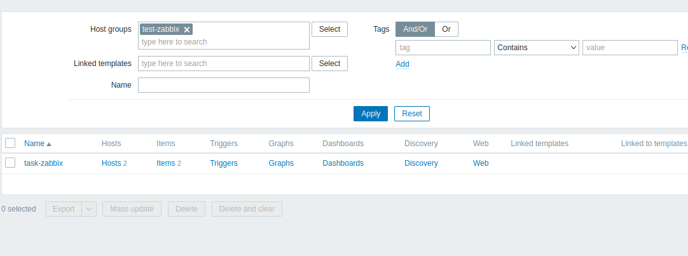
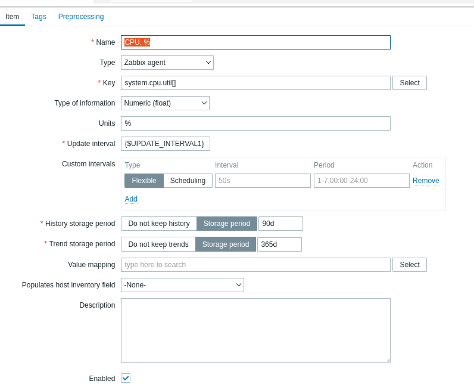
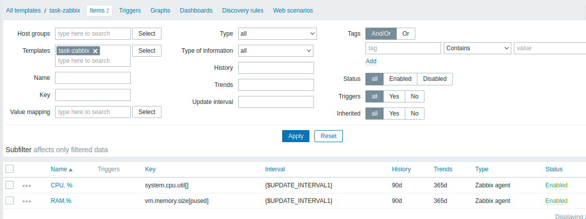
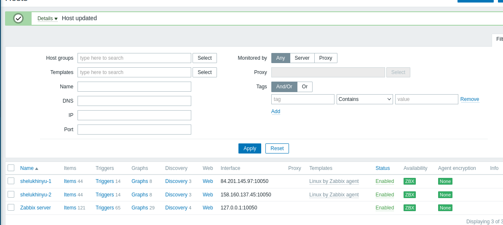
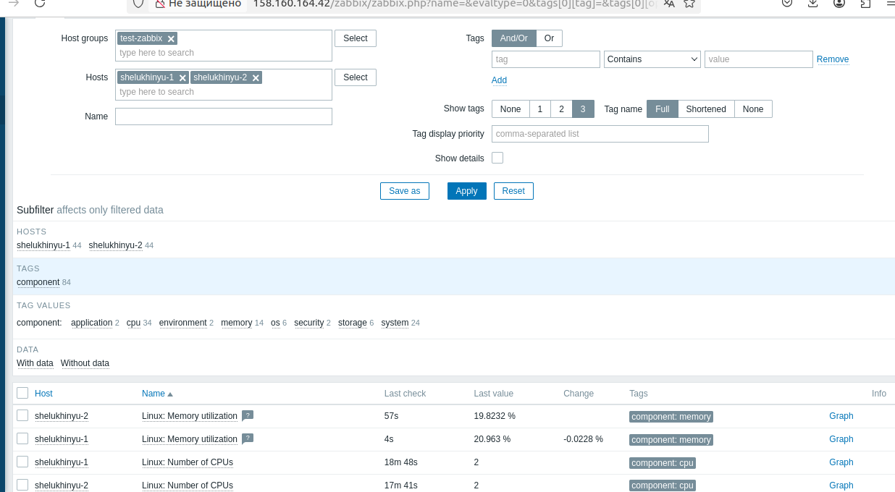
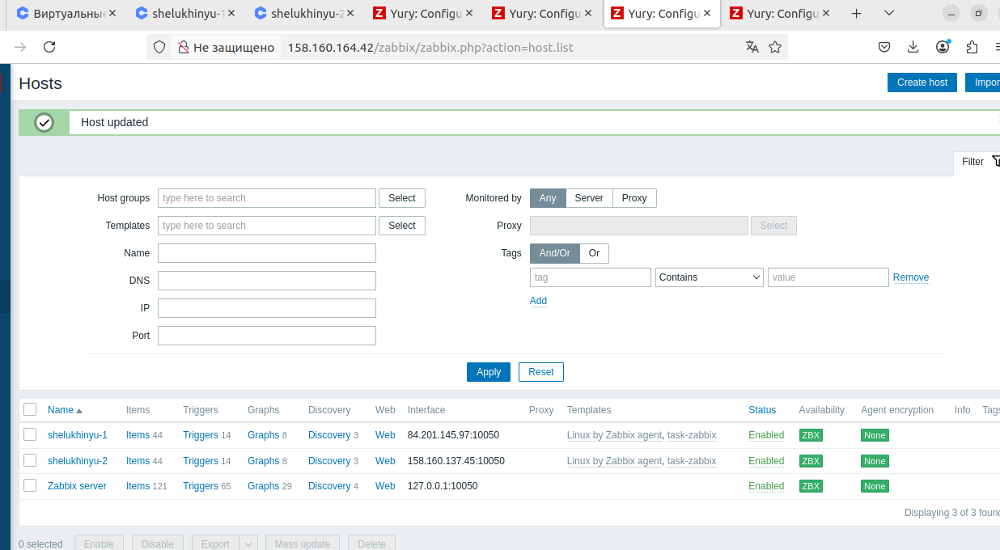
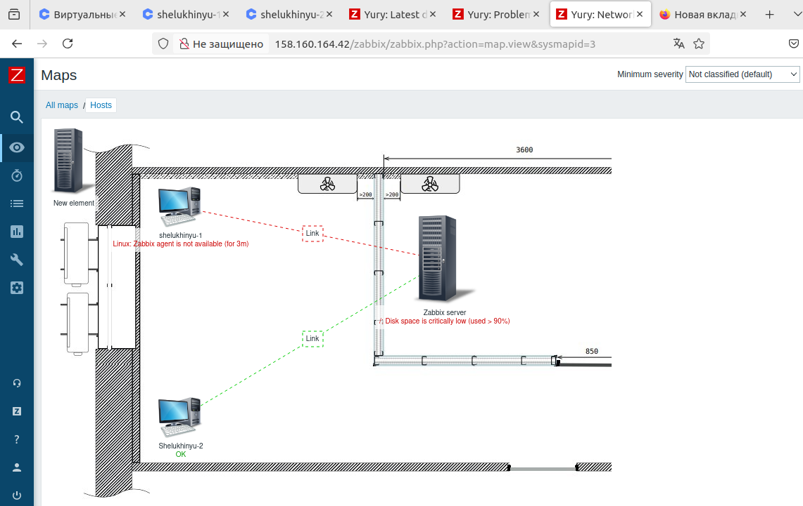

# Домашнее задание к занятию «Zabbix. Часть 2» Шелухин Юрий  

В практике есть 4 основных и 5 дополнительных (со звездочкой) заданий. Основные задания нужно выполнять обязательно, со звездочкой - по желанию и его решение никак не повлияет на получение вами зачета по этому домашнему заданию, при этом вы сможете глубже и/или шире разобраться в материале. 

Пожалуйста, присылайте на проверку все задачи сразу. Любые вопросы по решению задавайте в чате учебной группы.

### Цели задания
1. Научитья создавать свои шаблоны в Zabbix, добавлять в Zabbix хосты и связывать шаблон с хостами
2. Научиться составлять кастомный дашборд
3. Научиться создавать UserParameter на Bash
4. Научиться создавать Python-скрип, добавляться в него UserParameter и прикреплять к шаблону
5. Научиться создавать Vagrant-скрипты для Zabbix Agent

### Чеклист готовности к домашнему заданию
- [ ] Просмотрите в личном кабинете занятие "Система мониторинга Zabbix. Часть 2" 

### Задание 1

Создайте свой шаблон, в котором будут элементы данных, мониторящие загрузку CPU и RAM хоста.

#### Процесс выполнения
1. Выполняя ДЗ сверяйтесь с процессом отражённым в записи лекции.
2. В веб-интерфейсе Zabbix Servera в разделе Templates создайте новый шаблон
3. Создайте Item который будет собирать информацию об загрузке CPU в процентах
4. Создайте Item который будет собирать информацию об загрузке RAM в процентах

#### Требования к результату
- [ ] Прикрепите в файл README.md скриншот страницы шаблона с названием «Задание 1»

 ---

### Для решения заданий использованы 3-и виртуальные машины в Яндекс-облаке:
1. ВМ  "server-agent" с установленными Zabbix-сервером.      
2. ВМ  "shelukhinyu-1" с установленным Zabbix-агентом.    
3. ВМ  "shelukhinyu-2" с установленным Zabbix-агентом.    
 

## Решение 1

1-4.  Создадим  в веб-интерфейсе Zabbix Servera в разделе Templates новый шаблон c 2-мя item.   
 

  

---

### Задание 2
Добавьте в Zabbix два хоста и задайте им имена <фамилия и инициалы-1> и <фамилия и инициалы-2>. Например: ivanovii-1 и ivanovii-2.

#### Процесс выполнения
1. Выполняя ДЗ сверяйтесь с процессом отражённым в записи лекции.
2. Установите Zabbix Agent на 2 виртмашины, одной из них может быть ваш Zabbix Server
3. Добавьте Zabbix Server в список разрешенных серверов ваших Zabbix Agentов
4. Добавьте Zabbix Agentов в раздел Configuration > Hosts вашего Zabbix Servera
5. Прикрепите за каждым хостом шаблон Linux by Zabbix Agent
6. Проверьте что в разделе Latest Data начали появляться данные с добавленных агентов

#### Требования к результату
- [ ] Результат данного задания сдавайте вместе с заданием 3

## Решение 2  

1-3.  Установим Zabbix-агент на  две ВМ, в том же порядке как  при решении ДЗ "Zabbix", настроим в конфигурационном файле адрес Zabbix-сервера
4-5.  Добавим Zabbix Agentов в раздел Configuration, прикрепим за каждым хостом шаблон Linux by Zabbix Agent  
    
6. Проверим Latest Data  
  

 ---

### Задание 3
Привяжите созданный шаблон к двум хостам. Также привяжите к обоим хостам шаблон Linux by Zabbix Agent.

#### Процесс выполнения
1. Выполняя ДЗ сверяйтесь с процессом отражённым в записи лекции.
2. Зайдите в настройки каждого хоста и в разделе Templates прикрепите к этому хосту ваш шаблон
3. Так же к каждому хосту привяжите шаблон Linux by Zabbix Agent
4. Проверьте что в раздел Latest Data начали поступать необходимые данные из вашего шаблона

#### Требования к результату
- [ ] Прикрепите в файл README.md скриншот страницы хостов, где будут видны привязки шаблонов с названиями «Задание 2-3». Хосты должны иметь зелёный статус подключения

## Решение 3  

1-3.  Привяжем шаблоны к хостам.      

  
4. Проверим Latest Data  

  
  

 ---

### Задание 4
Создайте свой кастомный дашборд.

#### Процесс выполнения
1. Выполняя ДЗ сверяйтесь с процессом отражённым в записи лекции.
2. В разделе Dashboards создайте новый дашборд
3. Разместите на нём несколько графиков на ваше усмотрение.

#### Требования к результату
- [ ] Прикрепите в файл README.md скриншот дашборда с названием «Задание 4»

---

## Решение 4  

1-3.  Создадим дашбоард.      
  

 ---

### Задание 5* со звёздочкой
Создайте карту и расположите на ней два своих хоста.

#### Процесс выполнения
1. Настройте между хостами линк.
2. Привяжите к линку триггер, связанный с agent.ping одного из хостов, и установите индикатором сработавшего триггера красную пунктирную линию.
3. Выключите хост, чей триггер добавлен в линк. Дождитесь срабатывания триггера.

#### Требования к результату
- [ ] Прикрепите в файл README.md скриншот карты, где видно, что триггер сработал, с названием «Задание 5» 

 ---

## Решение 5* 

1.  Создадим карту,настроим линк между хостами. Привяжем шаблоны к хостам.      

  

2. Привяжем триггеры  к хостам.   

3. Выключим Zabbix Agent на одном хосте.
  

   Проверим срабатывание триггера на карте
    

---

### Задание 6* со звёздочкой
Создайте UserParameter на bash и прикрепите его к созданному вами ранее шаблону. Он должен вызывать скрипт, который:
- при получении 1 будет возвращать ваши ФИО,
- при получении 2 будет возвращать текущую дату.

#### Требования к результату
- [ ] Прикрепите в файл README.md код скрипта, а также скриншот Latest data с результатом работы скрипта на bash, чтобы был виден результат работы скрипта при отправке в него 1 и 2
 
 ---

### Задание 7* со звёздочкой
Доработайте Python-скрипт из лекции, создайте для него UserParameter и прикрепите его к созданному вами ранее шаблону. 
Скрипт должен:
- при получении 1 возвращать ваши ФИО,
- при получении 2 возвращать текущую дату,
- делать всё, что делал скрипт из лекции.

- [ ] Прикрепите в файл README.md код скрипта в Git. Приложите в Git скриншот Latest data с результатом работы скрипта на Python, чтобы были видны результаты работы скрипта при отправке в него 1, 2, -ping, а также -simple_print.*
 
 ---

### Задание 8* со звёздочкой

Настройте автообнаружение и прикрепление к хостам созданного вами ранее шаблона.

#### Требования к результату
- [ ] Прикрепите в файл README.md скриншот правила обнаружения, а также скриншот страницы Discover, где видны оба хоста.*

 ---

### Задание 9* со звёздочкой

Доработайте скрипты Vagrant для 2-х агентов, чтобы они были готовы к автообнаружению сервером, а также имели на борту разработанные вами ранее параметры пользователей.

- [ ] Приложите в GitHub файлы Vagrantfile и zabbix-agent.sh.*

## Критерии оценки

1. Выполнено минимум 4 обязательных задания
2. Прикреплены требуемые скриншоты, код и файлы 
3. Задание оформлено в шаблоне с решением и опубликовано на GitHub

